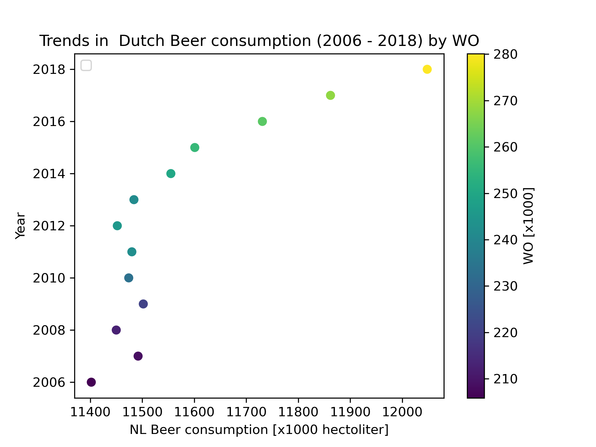

# Student ID = 16422805

# Papers:
## MCC Van Dyke et al., 2019:
1. Fantastic yeasts and where to find them: the hidden diversity of dimorphic fungal pathogens
2. The Rise of Coccidioides: Forces Against the Dust Devil Unleashed

## JT Harvey, Applied Ergonomics, 2002
1. An analysis of the forces required to drag sheep over various surfaces

## DW Ziegler et al., 2005
1. The neurocognitive effects of alcohol on adolescents and college students

## Data Visualization of istherecorrelation.csv

The dataset represents beer consumption in the Netherlands, measured in 1000 of hectoliter, from 2006 to 2018. Furthermore, the column WO [x1000] might represent the number of WO graduates. The plotted figure shows that the beer consumption gradually increases from about 11.4 million hectoliters in 2006 to around 12.0 million hectoliters in 2018. At the sam time the number of WO graduates arises from 206.000 students in 2006 to 260.000 students in 2018. This suggest that both beer consumption and the number of students (WO graduates) increased between 2006 -2018.